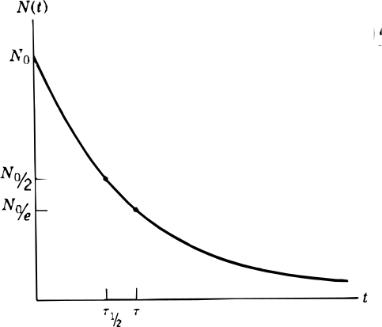
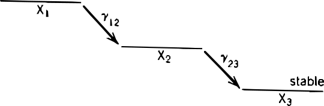
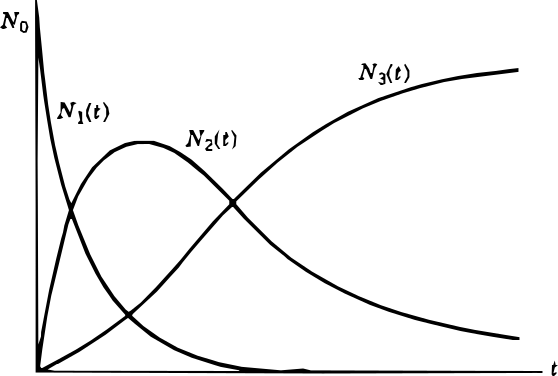

La estructura de un núcleo está definida por los estados del sistema cuántico nuclear. Un núcleo revela su estructura mediante una variedad de procesos interactivos en los cuales las transformaciones de los estados cuánticos ocurren como un fenómeno observable.

Uno de los fenómenos más relevantes que pone de manifiesto la dinámica interna del núcleo es la **radiactividad**, un proceso espontáneo mediante el cual un núcleo inestable se transforma en otro más estable, emitiendo partículas o radiación electromagnética. Esta transformación ocurre como resultado de un reordenamiento de los nucleones que lleva al sistema hacia un estado de menor energía.

Existen varios tipos fundamentales de **radiación nuclear**, clasificados según la naturaleza de las partículas o energía emitida:

- **Radiación alfa $(\alpha)$**: consiste en núcleos de helio-4 (dos protones y dos neutrones) que son expulsados del núcleo original. Este tipo de radiación tiene un poder de penetración bajo, pero una alta capacidad de ionización.
    
- **Radiación beta $(\beta)$**: ocurre cuando un neutrón se transforma en un protón (o viceversa), emitiendo un electrón $(\beta^-)$ o un positrón $(\beta^+)$, junto con un neutrino o antineutrino. La radiación beta tiene un poder de penetración moderado y también puede causar ionización.
    
- **Radiación gamma $(\gamma)$: corresponde a la emisión de fotones de alta energía cuando el núcleo pasa de un estado excitado a uno de menor energía sin cambiar su composición. Esta radiación es altamente penetrante y suele acompañar a otros tipos de desintegración.
    

Cada tipo de radiación refleja un modo específico de reorganización interna del núcleo, y su análisis permite comprender tanto la estabilidad nuclear como las transiciones entre estados. 

### Ley de desintegración exponencial

Algunos núcleos atómicos son inestables, lo que significa que con el tiempo tienden a desintegrarse en otros más estables. Este proceso se llama desintegración radiactiva. 

Sea $N$ como el número de núcleos de la especie $X$ de la muestra en un tiempo $t$.  Consideramos que el la muestra pierde $dN$ núcleos por desintegración en un intervalo. Si consideramos que el número de núcleos desintegrados debe ser proporcional al numero de núcleos de la muestra, escribimos:

$$
-dN = \lambda Ndt
$$

Para cuantificar la radiactividad de estos elementos, se introduce el concepto de **actividad**, que representa el número de desintegraciones nucleares por segundo:

$$
A \equiv \frac{dN}{dt} = -\lambda N
$$

Resolviendo esta ecuación diferencial se obtiene la **ley de desintegración exponencial**: 

$$
N(t) = N(0) \exp(-\lambda t)
$$

Un núcleo en una muestra realizara una transición $X \rightarrow Y$ desde un tiempo de $t=0$ en adelante con una probabilidad $\lambda$ por unidad de tiempo. Dicho esto, el tiempo de vida promedio puede expresarse como:

$$
\langle t\rangle = \frac{\int t \exp(-\lambda t) dt}{\int_0^{\infty} \lambda \exp(-\lambda t) dt} = \frac{1}{\lambda} \equiv \tau
$$

Sin embargo, experimentalmente se utiliza la vida media $\tau_{1/2}$, el cual es el tiempo requerido para que la cantidad de núcleos de una muestra se reduzca a la mitad de su valor inicial, es decir:

$$
N(\tau_{1/2}) = N(0) \exp(-\lambda\tau_{1/2}) = N(0)/2
$$

$$
\Rightarrow \tau_{1/2} = \frac{\log2}{\lambda}
$$

En la siguiente figura se puede ver un grafico de numero de partículas en función del tiempo, junto con la vida media y el tiempo de vida promedio:

#### Ejemplo

La unidad fundamental de actividad es el $\text{Ci}$ y corresponde al numero de desintegraciones de $1\text{g}$ de radón-${266}$ en un segundo. El número de núcleos de $^{266}\text{Ra}$ en esta cantidad será:

$$
N_{266} = \frac{1\text{g}}{266\frac{\text{g}}{\text{mol}}} \frac{6.022\times10^{23}}{\text{mol}} = 2.264 \times 10^{21} 
$$

Por otra parte la actividad esta definida por:

$$
A = -\lambda N = -\frac{\log2}{\tau} N
$$

Con una vida media $\tau$  de $1600$ años, aproximadamente $5.04 \times 10^{10} \text{s}$. Reemplazando en la actividad, podemos hallar el numero de desintegraciones por segundo correspondientes a un Curie:

$$
A = 3.858 \times 10^{10} \text{s} \equiv 1 \text{Ci}
$$

--- 
#### Ejemplo

Un método de producir un nucleido radiactivo consiste en colocar una muestra de una determinada sustancia en el interior de un reactor nuclear. Los nucleidos radiactivos se producen como consecuencia de la captura de un neutrón por los núcleos de la sustancia.

En un reactor nuclear se coloca $^{59}\text{Co}$. El nuevo nucleido se produce a razón de $g$ núcleos por segundo. Hallemos el número de núcleos radiactivos producido en función del tiempo.

Notemos que la reacción nuclear del cobalto al capturar el neutrón es:

$$
^{59}_{27} \text{Co} + n \rightarrow ^{60}_{27} \text{Co}
$$

El isotopo $^{59}\text{Co}$ es estable, por lo que la reducción en su población solo esta determinada por el numero de núcleos $g$ producidos, por otra parte los núcleos $^{60}\text{Co}$ si se desintegran por lo que se debe tener en cuenta su constante $\lambda$ de desintegración radiactiva.  Luego esta reacción implica los siguientes cambios en la poblaciones:

$$
\frac{dN_{59}}{dt} = -g \qquad
\frac{dN_{60}}{dt} = g - \lambda N_{60}
$$

Notemos que podemos simplificar la segunda ecuación diferencial realizando la siguiente sustitución:

$$
\bar{N}_{60} = N_{60} - \frac{g}{\lambda} \qquad \frac{d\bar{N}_{60}}{dt} = \frac{d\bar{N}_{60}}{dt}
$$

Obtenemos de esta forma una ecuación diferencial cuya solución es conocida:

$$
\frac{d\bar{N}_{60}}{dt} = -\lambda \bar{N}_{60}
\qquad
\bar{N}_{60}(t) = \bar{N}_{60}(0) \exp(-\lambda t)
$$

Sustituyendo nuevamente y usando la condición inicial $N_{60}(0) = 0$, obtenemos que la población de núcleos radiactivos de $^{60} \text{Co}$ estará dada por:

$$
N_{60}(t) = \frac{g}{\lambda}(1- \exp(-\lambda t))
$$

Esto nos dice que a largo plazo el numero de núcleos radiactivos converge a limite $g/\lambda$, es decir una **población estacionaria** donde el número de núcleos que se generan por segundo es igual al número de núcleos que decaen por segundo.

### Reacciones en cadena

Muchos radionucleidos muestran su actividad en cascadas de desintegraciones secuenciales. Supongamos una cascada de dos pasos $X_1 \rightarrow X_2 + r$ y $X_2 \Rightarrow X_3 + r'$ como muestra en la siguiente figura:

Este proceso puede describirse en termino de las siguientes ecuaciones diferenciales:

$$
\begin{aligned}
\frac{dN_1}{dt} = -\lambda_{12} N_1
\\ \\
\frac{dN_2}{dt} = \lambda_{12}N_1 - \lambda_{23} N_2
\\ \\
\frac{dN_3}{dt} = \lambda_{23} N_3
\end{aligned}
$$

El numero de núcleos desintegrados se conserva, por lo que si en un principio hay $N_0$ núcleos, entonces: 

$$
N_1(t) + N_2(t) + N_3(t) = N_0
$$

Resolvamos este sistema de ecuaciones. La solución a la primera ecuación es simplemente la ley de desintegración exponencial.

$$
N_1(t) = N_0 \exp(-\lambda_{12}t)
$$

Para la segunda proponemos una solución homogénea y una particular tales que $N_2 = N_{2h} + N_{2p}$. La solución homogénea verifica que:

$$
\frac{dN_{2h}(t)}{dt} = -\lambda_{23} N_{2h}(t) \Rightarrow N_{2h}(t) = c\exp(-\lambda_{23}t)
$$

Por otra parte se propone una solución particular:

$$
N_{2p}(t) = A(t) N_{2h}(t)
$$

$$
\frac{d N_{2p}(t)}{dt} = A'(t)N_{2h}(t) + A(t) \frac{dN_{2h}(t)}{dt} = -\lambda_2N_{2p}(t) + \lambda_{12}N_0 \exp(-\lambda_{12}t)
$$

Notemos que:

$$
A(t)\frac{dN_{2h}(t)}{dt} = -\lambda_{23}A(t) N_{2h}(t) = -\lambda_{23} N_{2p}(t)
$$

Luego:

$$
A'(t)N_{2h}(t) = A'(t) c\exp(-\lambda_{23}t) = \lambda_{12}N_0 \exp(-\lambda_{12}t)
$$

$$
A(t) = \frac{\lambda_{12}N_0}{c(\lambda_{23} - \lambda_{12})} \exp\big[(\lambda_{23}-\lambda_{12}) t \big]
$$

Reemplazando obtenemos $N_2$ y usando la condición $N_2(0) = 0$:

$$
N_2(t) = \frac{\lambda_{12}N_0}{\lambda_{23} - \lambda_{12}} \exp(-\lambda_{12}t) + c\exp(-\lambda_{23}t)
$$

Usando la condición inicial para remover la constante $c$ de integración:

$$ 
N_2(0) = \frac{\lambda_{12}N_0}{\lambda_{23} - \lambda_{12}} + c = 0
$$

Obtenemos una expresión para $N_2(t)$:

$$
N_2(t) = \frac{\lambda_{12}N_0}{\lambda_{23} - \lambda_{12}} (\exp(-\lambda_{12} t) - \exp(-\lambda_{23}t))
$$

Miremos finalmente la tercera ecuación diferencial. Reemplazando en $N_2$ la expresión obtenida anteriormente:

$$
\frac{dN_3(t)}{dt} = \lambda_{23} N_2(t) = \frac{\lambda_{12}\lambda_{23}}{\lambda_{23} - \lambda_{12}}N_0  (\exp(-\lambda_{12} t) - \exp(-\lambda_{23}t))
$$

Integrando ambos miembros con respecto a $t$ y una nueva constante $c$ de integración:

$$
N_3(t) = \frac{N_0 \lambda_{12} \lambda_{23}}{\lambda_{23} - \lambda_{12}} (\frac{\exp(-\lambda_{12} t)}{-\lambda_{12}} - \frac{\exp(-\lambda_{23}t)}{-\lambda_{23}}) + c
$$

Usando la condición de contorno para remover la constante:

$$
N_3(0) =  \frac{N_0 \lambda_{12}\lambda_{23}}{\lambda_{23} - \lambda_{12}} (\frac{1}{-\lambda_{12}} - \frac{1}{-\lambda_{23}}) + c = - N_0 + c = 0
$$

Obtenemos finalmente una expresión para $N_3$. 

$$
N_3(t) = N_0(1-\frac{ \lambda_{23} \exp(-\lambda_{12}t) - \lambda_{12}\exp(-\lambda_{23}t)}{\lambda_{23} - \lambda_{12}})
$$

Podemos graficar los tres resultados obtenidos y obtenemos curvas como las del siguiente grafico:

En donde:

$$
N_1(t) = N_0 \exp(-\lambda_{12}t)
$$

$$
N_2(t) = \frac{N_0 \lambda_{12}}{\lambda_{23} - \lambda_{12}} (\exp(-\lambda_{12} t) - \exp(-\lambda_{23}t))
$$

$$
N_3(t) = N_0(1-\frac{ \lambda_{23} \exp(-\lambda_{12}t) - \lambda_{12}\exp(-\lambda_{23}t)}{\lambda_{23} - \lambda_{12}})
$$

--- 

### Abundancias

#### Ejemplo

La abundancia actual de los isótopos $^{235}\text{U}$ y $^{238}\text{U}$ es de $0,72\%$ y $99,27\%$ respectivamente. Estimemos la edad de la tierra.

Las vidas medias de los isotopos $^{235}\text{U}$ y $^{238}\text{U}$ serán de $7.04 \times 10^8$ años y $4.468 \times 10^9$ años respectivamente y se supone que en el génesis la población relativa de ambos isótopos era la misma. 

Si $t$ es la edad de la tierra, para una población $N$ se verifica la ley de desintegración exponencial:

$$
N(t) = N(0) \exp(-\lambda t)
$$

Con $\lambda = \log 2 / \tau$. Igualando ahora para ambos isotopos sus poblaciones iniciales:

$$
N_{238}(0) = N_{235}(0)
$$

$$
N_{238}(t) \exp(\lambda_{238}t) = 
N_{235}(t) \exp(\lambda_{235}t)
$$

Usando las poblaciones relativas:

$$
\frac{N_{238}(t)}{N_{235}(t)} = \frac{9927}{72} = 137.875= \exp(\lambda_{235}t - \lambda_{238}t)
$$

$$
(\lambda_{235} - \lambda_{238}) t = (\frac{\log2}{\tau_{235}} - \frac{\log2}{\tau_{238}})   t =  \log(137.875) 
$$

$$
t = \frac{\log(137.875) / \log(2)}{\frac{1}{7.04 \times10^8} - \frac{1}{44.68 \times10^8}} \text{años} \approx 4 \times 10^9 \text{años}
$$

Un valor del mismo orden de la edad conocida de la tierra de 4.543 miles de millones de años. 

--- 

#### Ejemplo

La razón másica entre el radioisótopo $^{14}\text{C}$ y el $^{12}C$ es de $1.5 \times 10^{-12}$, por otra parte en una muestra de carbón de $64 \text{g}$ se observan $2$ desintegraciones por segundo. Hallemos la edad de la muestra considerando que la vida media del $^{14}\text{C}$ es de $5700$ años. 

Primero hallemos el numero de desintegraciones por segundo de $1 \text{g}$ de materia viva. La actividad de esta dada por:

$$
A = \lambda_{14} N_{14} = \frac{\log2}{\tau_{14}} N_{14}
$$

En donde $N_{14}$ corresponde a la cantidad de núcleos de $^{14}\text{C}$ de la muestra. En $1\text{g}$ de materia 

$$
1\text{g} = m_{12} + m_{14} = m_{14}(\frac{m_{12}}{m_{14}} + 1) = m_{14}(\frac{1}{\eta} +1)
$$

Con $\eta$ la relación másica entre el $^{14}\text{C}$ y el $^{12}\text{C}$ conocida. Podemos ahora usar la masa molar del $^{14}\text{C}$ y el numero de Avogadro para hallar el numero de núcleos $N_{14}$ de la muestra.

$$
N_{14} = N_{A} \frac{1\text{g}}{(\frac{1}{\eta} + 1)} \frac{1}{14\text{g}/\text{mol}} = 6.45 \times 10^{9} 
$$

Teniendo en cuenta la vida media del carbono-14 de unos $1.7 \times 10^{11} \text{s}$ aproximadamente, hallamos la actividad como:

$$
A = 0.25 \text{s}^{-1}
$$

El hecho de que la muestra sea de materia viva, implica que la cantidad de es igual a la de la atmosfera, puesto a que el proceso de fotosíntesis incorpora el átomo radiactivo en los organismos autótrofos, y estos son consumidos luego por los heterótrofos.

Se tiene ahora que la actividad de la muestra de carbón $64\text{g}$ es de $2$ desintegraciones por segundo, una actividad menor a la obtenida en el resultado anterior, es decir al transcurrir el tiempo una fracción de los núcleos de $^{14} \text{C}$ se desintegraron y la actividad disminuyo con respecto a la de la materia viva.

Luego si se toma la relación másica de núcleos de $^{14} \text{C}$ en la muestra de carbón igual a la de la materia viva en $t=0$ usando la ley de desintegración exponencial:

$$
N_{14}(t) = N_{14}(0) \exp(-\frac{\log2}{\tau_{14}} t)
\Rightarrow 
t = \tau_{14} \frac{\log(\frac{N_{14}(0)}{N_{14}(t)})}{\log2}
$$

En donde la relación entre poblaciones puede hallarse directamente como:

$$
\frac{N_{14}(0)}{N_{14}(t)} = \frac{m_{14}(0)}{m_{14}(t)} = \frac{A(0)}{A(t)} \approx \frac{(0.25)}{2/64} = 2^3
$$

Al tomar logaritmos, bajar el exponente y dividir por $\log2$ los logaritmos se cancelan, luego la edad de la muestra será simplemente $5700 * 3 = 17100$ años.  

--- 