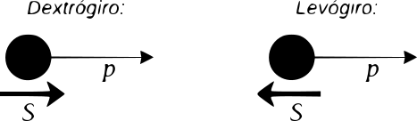

Una simetría se define como una operación que puede ser efectuada en un sistema dejándolo invariante. El conjunto de todas las simetrías tiene las siguientes propiedades:

- *Clausura*: Si $R_i$ y $R_j$ están en el conjunto entonces el producto $R_i R_j$  esta en el conjunto.
	
- *Identidad*: Existe un elemento $I$ tal que $IR_i = R_i I = R_i$ para todos los elementos $R_i$.
	
- *Inversa*: Para cada elemento $R_i$ existe una inversa $R_i^{-1}$ tal que $R_i R_i^{-1} = I$.
	
- *Asociatividad*: Para elementos $R_i$, $R_j$ y $R_k$ se verifica que $(R_i R_j) R_k = R_i (R_j R_k)$.  

Definidas de esta forma, estas propiedades forman lo que se denomina grupo. Nótese que los elementos de un grupo no necesariamente conmutan. Si estos conmutan entonces el grupo se denomina *Abeliano*. 

La mayoría de los grupos de interés en física pueden ser formulados en términos de *grupo de matrices*. Denotamos:

- $U(n)$ al grupo de todas las matrices $n \times n$ unitarias.  
	
- $SU(n)$ al grupo de todas las matrices $n \times n$ unitarias cuyo determinante es $1$. 
	
- $O(n)$ al grupo de todas las matrices $n \times n$ ortogonales. 
	
- $SO(n)$ al grupo de todas las matrices $n\times n$ ortogonales cuyo determinante es $1$. 

Finalmente, cada grupo $G$ puede ser representado por un grupo de matrices, es decir a cada elemento $a \in G$ le corresponde una matriz $M_a$ y la correspondiente operación de multiplicación, es decir si $ab = c$ entonces $M_a M_b = M_c$.

Siempre es posible construir una nueva representación matricial de un grupo combinando otras dos existentes, es decir si $M_a^{(1)}$ y $M_a^{(2)}$ son representaciones de $G$ entonces una nueva representación puede ser construida como:

$$
M_a = \begin{pmatrix} M_a^{(1)} & 0 \\ 0 & M^{(2)}_a \end{pmatrix}
$$

Es por esto que cuando hablamos de la representación de un grupo, nos referimos a las *representaciones irreducibles* de este. 

### Isospín (I)

Si se deja de lado la carga y la pequeña diferencia de masa entre el neutrón y el protón, podemos considerar que ambos pueden ser estados de una misma partícula, el nucleón. Denotemos a estos estados como:

$$
\ket{p} = \begin{pmatrix}1 \\0 \end{pmatrix} \qquad \ket{n} = \begin{pmatrix} 0 \\ 1 \end{pmatrix}
$$

Introducimos entonces al *isospín* $\vec{I}$ como al operador generado de simetrías internas, en este caso asociado al grupo $SU(2)$, que actúa sobre el doblete de nucleones $(p, n)$. Esta construcción es análoga a la del espín en mecánica cuántica, pero en un espacio interno de sabor de las partículas.

Los generadores del grupo $SU(2)$ se representan mediante matrices de Pauli y las componentes del isospín pueden escribirse como:

$$
\hat{I}_i = \frac{1}{2} \hat{\sigma}_i \qquad i=1,2,3
$$

En donde:

$$
\sigma_1 = \begin{pmatrix} 0 & 1 \\  1 & 0 \end{pmatrix} \qquad
\sigma_2 = \begin{pmatrix} 0 & -i \\  i & 0 \end{pmatrix} \qquad
\sigma_3 = \begin{pmatrix} 1 & 0 \\  0 & -1 \end{pmatrix} \qquad
$$
 
 Estos operadores satisfacen las relaciones de conmutación d $SU(2)$. Los autovalores del operador $I_3$​, componente del isospín, permiten distinguir al protón del neutrón como:

$$
\hat{I}_3 p = \frac{1}{2} \ket{p} \qquad \hat{I}_3 n = -\frac{1}{2} \ket{n}
$$

Y podemos usar la misma notación que para los momentos angulares:

$$
\ket{p} = \ket{\frac{1}{2}, \frac{1}{2}} \qquad \ket{n} =  \ket{\frac{1}{2}, \frac{1}{2}} 
$$
 
 Heisenberg propuso que la interacción fuerte es invariante bajo rotaciones en el espacio del isospín. Esto es lo que denominamos una simetría interna. Por ejemplo, una rotación de $180^\circ$ alrededor del eje $1$ en el espacio del isospín convierte a un protón en un neutrón y viceversa. Luego, por el teorema de Noether, se concluye que el isospín se conserva en todas las interacciones fuertes.

La simetría de isospín también es aplicable a todos los estados que conforman los múltipletes de hadrones, generalizando así el tratamiento del protón y el neutrón a otros sistemas. Consideremos por ejemplo el pión, asignamos a estos un isospín $I_3=1$ y denotamos:

$$
\pi^+ = \ket{1,1} \qquad
\pi^0 = \ket{1,0} \qquad
\pi^- = \ket{1,-1} \qquad
$$

De la misma forma para las partículas delta, a las cuales asignamos un isospín $I_3 = 3/2$ y denotamos:

$$
\Delta^{++} = \ket{\frac{3}{2}, \frac{3}{2}} \qquad
\Delta^{+} = \ket{\frac{3}{2}, \frac{1}{2}} \qquad
\Delta^{0} = \ket{\frac{3}{2}, -\frac{1}{2}} \qquad
\Delta^{-} = \ket{\frac{3}{2}, -\frac{3}{2}} \qquad
$$

Para determinar el isospín $I_3$ de un multiplete contamos las partículas que lo contienen. Dado a que los autovalores de $\hat{I}_3$ varían de $-I_3$ hasta $I_3$ en números enteros, el numero de partículas en un multiplete es $2I_3 + 1$. 

La componente $\hat{I}_3$ del isospín puede asociarse a la carga $Q$ de una partícula. Asociamos al máximo autovalor de $\hat{I}_3$ el miembro del multiplete con mayor carga y al mínimo con el de menor carga.  La relación explicita carga isospín es la relación *Gell Mann - Nishijima*:

$$
Q = I_3 + \frac{1}{2}(A + S)
$$

En donde $A$ es el numero bariónico y $S$ la extrañeza de la partícula.

El isospín tiene también implicaciones dinámicas en los hadrones, por ejemplo, si consideramos dos nucleones, podemos construir los siguientes estados combinados de isospín. El **isotriplete simétrico** se expresa como:

$$
\ket{1,1} = \ket{p,p} \qquad 
\ket{1,0} = \frac{\ket{p,n} + \ket{p,n}}{\sqrt{2}} \qquad 
\ket{1,-1} = \ket{n,n}
$$

Mientras que el **isosinglete antisimétrico** es:

$$
\ket{0,0} = \frac{\ket{p,n} - \ket{n,p}}{\sqrt{2}}
$$

Experimentalmente el neutrón y el protón forman un solo estado singlete ligado, el deuterón $\ket{d}$. No hay estado ligado para dos protones o dos neutrones, por lo que el deuterón debe ser el isosinglete. 

### Paridad (P)

La **simetría de paridad (P)** es la simetría con respecto a la transformación que invierte el espacio, como una **imagen especular**. En física, si una interacción es **invariante bajo paridad**, significa que se comporta igual en el mundo real que en su reflejo.

La helicidad de una partícula es dextrógira si la dirección de su espín coincide con la dirección de su movimiento, y es levógira si las direcciones del espín y del movimiento son opuestas.  

Matemáticamente, la helicidad es el signo de la proyección del vector de espín sobre el vector momento: levógira es negativa, dextrógira es positiva.

La **quiralidad**, en cambio, es una propiedad intrínseca relacionada con cómo las partículas se transforman bajo las simetrías del Modelo Estándar. No depende directamente del movimiento, sino de la estructura del campo cuántico de la partícula. Para partículas **masivas**, helicidad y quiralidad **no coinciden necesariamente**, pero para partículas **sin masa**, como el fotón o idealizaciones del neutrino, **sí coinciden**.

Las interacciones fuerte y electromagnética son **ambidextras**, lo que significa que **no distinguen entre partículas con quiralidad izquierda y derecha**: tratan a ambas por igual.

En contraste, la interacción débil distingue entre quiralidades, solo las partículas con quiralidad izquierda (y las antipartículas con quiralidad derecha) participan en este tipo de interacción.

Este comportamiento implica que la interacción débil **viola la simetría de paridad (P)**, ya que no trata de la misma forma a un sistema y a su imagen especular.

Esto fue probado en los años 50 con **el experimento de Wu**, utilizando núcleos radiactivos de $^{60}\text{Co}$ enfriado a temperaturas muy bajas y sometido a un fuerte campo magnético para alinear sus espines. 

Estos se desintegraban en $^{60}\text{Ni}$ mas un electrón y un anti-neutrino electrónico, si la simetría de paridad se conservara, los electrones emitidos durante la desintegración deberían distribuirse simétricamente con respecto al eje de espín del núcleo. Sin embargo, Wu observó que los electrones eran emitidos preferentemente **en dirección opuesta al espín nuclear**, indicando una clara violación de la simetría de paridad.

Denotamos con $\hat{P}$ al operador inversión. Cuando se aplica a un vector $\vec{a}$, el operador $\hat{P}$ produce un vector apuntando en la dirección opuesta, es decir:

$$
\hat{P} \vec{a} = -\vec{a} 
$$

Sin embargo si se aplica $\hat{P}$ un producto vectorial $\vec{c} = \vec{a} \times \vec{b}$, el operador cambia el signo tanto de $\vec{a}$ como $\vec{b}$, luego el resultado es invariante ante $\hat{P}$ es decir:

$$
\hat{P} \vec{c} = \vec{c}
$$

Se denomina a los primeros entonces como **vectores polares** y a los segundos **vectores axiales**.  Si se aplica el operador paridad dos veces se obtiene el mismo vector, por lo que el grupo de paridad tiene solo dos elementos $\hat{P}$ y $\hat{I}$. Los autovalores del operador paridad son $\pm 1$. 

La paridad de un fermión debe ser opuesta la de su correspondiente anti-partícula. Por otra parte la paridad de un bosón debe ser la misma que la de su anti-partícula. La paridad de un agregado compuesto en su estado fundamental es igual al producto de las paridades de sus constituyentes. 

### Conjugación de carga (C)

La electrodinámica clásica es invariante bajo la inversión del signo de las cargas eléctricas. Introducimos entonces una operación denominada conjugación de carga, representado por el operador $\hat{C}$, que transforma una partícula en su antipartícula correspondiente.

$$
\hat{C} \ket{p} = \ket{\bar{p}}
$$

Al igual que el operador paridad, aplicar dos veces el operador de conjugación de carga devuelve la partícula original, es decir:

$$
\hat{C}^2 \ket{p} = \hat{I}\ket{p} = \ket{p}
$$

Luego los autovalores de $\hat{C}$ son $\pm1$ al igual que con $\hat{P}$, sin embargo la mayoría de las partículas no son autoestados de $\hat{C}$, solo aquellas partículas que son sus propias antipartículas son autoestados de $\hat{C}$, es decir todas aquellas partículas que son sus propias antipartículas, como por ejemplo:

$$
\pi^0, \eta, \eta', \rho^0, \phi, \omega, \psi
$$

El conjugado de carga es un numero cuántico multiplicativo, y se conserva para todas las interacciones fuertes y electromagnéticas. 

Supongamos que realizamos una rotación de $180^\circ$ en el espacio del isospín alrededor del eje correspondiente a $I_2$ del espacio isospín, esto transformara la tercera componente isospín como $I_3 \rightarrow -I_3$  convirtiendo por ejemplo un pion $\pi^+$ en uno $\pi^-$. Luego si se aplica el conjugado de carga se vuelve a tener el pion original $\pi^+$. Esto nos dice que las partículas cargadas son autoestados del operador asociado a esta operación combinada, aun sin ser autoestados de $\hat{C}$. Este operador es denominado $G$-paridad y se lo escribe como:

$$
\hat{G} = \hat{C} \hat{R}_2 \qquad \text{con } \hat{R}_2 = e^{i\pi I_2}
$$
 
Todos los mesones compuestos únicamente por quarks _up_ y _down_, es decir, aquellos sin contenido de extrañeza (ni tampoco encanto o belleza), son autoestados del operador $\hat{G}$. Como $\hat{G}$ es un operador unitario y conmutativo con el hamiltoniano de la interacción fuerte, sus autovalores $g$ son números cuánticos bien definidos, y valen $\pm1$. En particular, para los mesones neutros del octeto pseudoscalar, la $G$-paridad puede calcularse como:

$$
G = C \cdot (-1)^I
$$

Donde $C$ es el valor del conjugado de carga (cuando está definido) e $I$ es el isospín total del estado. Este resultado proviene de analizar cómo actúan $\hat{C}$ y $\hat{R}_2$ sobre los estados de isospín.

Por ejemplo, para el pión neutro $\pi^0$, que tiene isospín $I = 1$ y es su propia antipartícula ($C = +1$), se tiene:

$$
G_{\pi^0} = (+1) \cdot (-1) = -1
$$

De hecho, todos los piones ($\pi^+, \pi^0, \pi^-$), al formar un triplete de isospín con $I=1$, tienen $G = -1$. Esto implica que cualquier estado multipión con un número impar de piones tiene $G = (-1)^n = -1$, y si el número de piones es par, el $G$ será positivo.

Este número cuántico se conserva en las interacciones fuertes, por lo tanto, decaimientos de mesones neutros como el $\rho^0$ (que tiene $G = +1$) a un número impar de piones (con $G = -1$) están prohibidos por la conservación de la $G$-paridad.

### Conjugación de carga-paridad (CP)

Como se vio, las interacciones débiles no son invariantes bajo transformaciones de paridad, ni tampoco bajo conjugación de carga; sin embargo, sí lo son bajo su combinación, es decir, bajo la acción del operador $\hat{C} \hat{P}$.

---

