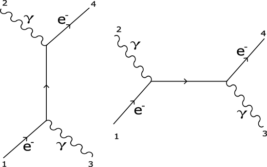

El efecto Compton (o dispersión Compton) consiste en el aumento de la longitud de onda de un fotón cuando choca con un electrón libre y pierde parte de su energía. 

Este proceso puede escribirse como $e^- + \gamma \rightarrow e^- + \gamma$.  Escribamos sus $4$-momentos desde un marco de referencia para el cual la $3$-velocidad inicial del electrón es nula y en el cual el fotón viaja sobre el eje $z$.

$$
p_1 = (mc, \vec0) \quad p_2 = (\hbar \omega /c, \hbar \vec{k}) \quad  p_3 = (\hbar \omega'/c, \hbar \vec k') \quad p_4 =(E/c, \vec p) 
$$

Como el fotón no tiene masa, el factor de flujo se reduce a $4(p_1\cdot p_2) = 4m_ec \hbar\omega$ . Luego la sección transversal será:

$$ 
\begin{aligned}
\sigma = \frac{\hbar^2 S}{4mc \hbar\omega}\int(2\pi)^4|\mathcal{M}|^2 \delta^4(p_1+p_2-p_3-p_4) \\
\times 2 \pi \delta(p_3^2 - m_e^2c^2)\theta(p^0_3) 2 \pi \delta(p_4^2)\theta(p^0_4) \frac{d^4p_3}{(2\pi)^4} \frac{d^4p_4}{(2\pi)^4}
\end{aligned}
$$

$$ 
\begin{aligned}
\sigma = \frac{\hbar^2 S}{4\hbar\omega m} \frac{1}{(2\pi)^2} \int |\mathcal{M}^2| \delta(mc + \hbar|\vec{k}| - p_3^0 -p_4^0) \delta^3(\hbar \vec{k} - \vec{p}_4 - \vec{p_3}) \\
\times
\frac{\delta(p_3^0- |\vec{p}_3|)}{2|\vec{p}_3|} 
\frac{\delta(p^0_4-\sqrt{|\vec{p_4}|^2+m^2c^2})}{2\sqrt{|\vec{p_4}|^2+m^2c^2}}d^4p_3 d^4p_4
\end{aligned}
$$

$$
\sigma = \left(\frac{\hbar}{8\pi} \right)^2 \frac{S}{\hbar m\omega} \int 
|\mathcal{M}|^2 \frac
{\delta(mc + \hbar|\vec{k}| - |\vec{p_3}| - \sqrt{|\vec{p_4}|^2+(mc)^2})}
{|\vec{p}_3| \sqrt{|\vec{p_4}|^2 + (mc)^2}} \delta(\vec{p}_3 + \vec{p}_4 - \hbar\vec{k}) d^3 \vec{p}_3 d^3 \vec{p_4}
$$

Analicemos la delta de Dirac restante. Sea $\theta$ el ángulo entre el fotón incidente y el dispersado. Notemos que podemos escribir $\vec{p}_4$ como:

$$
\vec{p_4} = \hbar \vec{k} - \vec{p}_3 \Rightarrow |\vec{p}_3
| = \sqrt{(\hbar|\vec{k}|)^2 + |\vec{p}_3| - 2 \hbar|\vec{k}||\vec{p}_3| \cos \theta }$$

$$
\Rightarrow \sqrt{|\vec{p}_4|^2 + (mc)^2} = \sqrt{(\hbar|\vec{k}|)^2 + |\vec{p}_3| - 2 \hbar|\vec{k}||\vec{p}_3| \cos \theta + (mc)^2} 
$$

Tomando $u = \sqrt{|\vec{p}_4|^2+(mc)^2} + |\vec{p}_3|$ y reemplazando lo anterior:

$$
u = \sqrt{(\hbar|\vec{k}|)^2 + |\vec{p}_3|^2 - 2 \hbar|\vec{k}||\vec{p}_3| \cos \theta + (mc)^2} + |\vec{p}_3|
$$

$$
\frac{du}{d|\vec{p_3}|} = \frac{|\vec{p}_3| - \hbar{\vec{k} \cos \theta}}{u - |\vec{p}_3|} + 1 =  \frac{u - \hbar{\vec{k} \cos \theta}}{u - |\vec{p}_3|} 
$$

Integrando sobre $\vec{p}_4$ y derivando sobre el ángulo solido $\Omega$, la integral queda solo en términos del modulo $|\vec{p}_3|$. Reemplazando $u$ en la integral: 

$$
\frac{d\sigma}{d\Omega} = \left(\frac{\hbar}{8\pi}\right)^2 \frac{S}{\hbar\omega m} |\mathcal{M}|^2 
\int_0^{\infty} \frac{\delta(mc + \hbar|\vec{k}| - u)}{(u-|\vec{p}_3|)|\vec{p}_3|} |\vec{p}_3|^2 d|\vec{p}_3|
$$

Haciendo el cambio de variable:

$$ 
\frac{d\sigma}{d\Omega} = \left(\frac{\hbar}{8\pi}\right)^2 \frac{S}{\hbar\omega m} |\mathcal{M}|^2 \int_0^{\infty} \frac{\delta(mc + \hbar|\vec{k}| - u)}{ u - \hbar |\vec{k}| \cos\theta} |\vec{p}_3| du
$$

Al integrar la delta Dirac nos genera la siguiente igualdad. 

$$ 
u = mc + \hbar|\vec{k}| = \sqrt{(\hbar|\vec{k}|)^2 + |\vec{p}_4|^2 - 2 \hbar|\vec{k}||\vec{p}_4| \cos \theta + (mc)^2} + |\vec{p}_4|
$$

$$
(mc + \hbar|\vec{k}| - |\vec{p}_4|)^2 = (\hbar|\vec{k}|)^2 + |\vec{p}_4|^2 - 2\hbar|\vec{k}| |\vec{p_4}| \cos \theta + (mc)^2
$$

$$
mc \hbar|\vec{k}| - mc |\vec{p}_4| - \hbar|\vec{k}| |\vec{p}_4|= -\hbar|\vec{k}| |\vec{p}_4| \cos \theta
$$

$$
mc\hbar|\vec{k}| = |\vec{p}_4|(mc+\hbar|\vec{k}|-\hbar|\vec{k}|\cos\theta)
$$

$$
|\vec{p}_4| = \frac{mc\hbar|\vec{k}|}{mc+\hbar|\vec{k}|(1-\cos\theta)} = \frac{mc\hbar |\vec{k}|}{u - \hbar|\vec{k}|\cos \theta}
$$

Podemos finalmente reemplazara en la sección eficaz diferencial este valor de $|\vec{p}_4|$, y $S = 1$ y obtenemos:

$$ 
\frac{d\sigma}{d\Omega} = \left(\frac{\hbar}{8\pi}\right)^2 \frac{S}{\hbar\omega m} |\mathcal{M}|^2 \int_0^{\infty} \frac{\delta(mc + \hbar|\vec{k}| - u)}{(u - \hbar |\vec{k}| \cos\theta)^2}  mc\hbar|\vec{k}| du
$$

Integrando sobre $u$ la sección transversal diferencial será:

$$
\frac{d\sigma}{d\Omega} = \left(\frac{\hbar c}{8\pi}\right)^2 \frac{|\mathcal{M}|^2} {[mc^2 + \hbar \omega(1-\cos\theta)]^2} 
$$

Con $\omega$ la frecuencia del fotón incidente y $\theta$ el ángulo del fotón dispersado con respecto a este. Hallemos ahora la amplitud $\mathcal{M}$ usando el ritual de Feynman. Notemos que para  el proceso $e^- + \gamma \rightarrow e^- + \gamma$ hay dos diagramas de Feynman de segundo orden. 

Siguiendo el ritual de Feynman asociamos a los diagramas: 
	
- $4$-momentos $p_1$, $p_2$, $p_3$ y $p_4$ a las líneas externas y $q$ a la línea interna. 
	
- Estados $u^{(s_1)}$,  $\epsilon^{(s_2)}$, $\epsilon^{*(s_3)}$ y $\bar{u}^{(s_4)}$.
	
- Constantes de acople $ig_e \gamma^{\mu}$ y $ig_e \gamma^{\nu}$ en donde $g_e$ es la constante de acoplamiento $g_e = \sqrt{4\pi \alpha}$.
	
- El propagador correspondiente a un fermión $i \frac{\gamma^{\mu} q_{\mu} + mc}{q^2 - (mc)^2}$.
	
- Términos asociados a la conservación del momento y energía $(2\pi)^4\delta^4(p_1 - q - p_3)$ y $(2\pi)^4\delta^4(p_2 + q - p_4)$ al primer diagrama y  $(2\pi)^4\delta^4(p_1 + p_2 - q)$ y $(2\pi)^4\delta^4(q - p_3 - p_4)$ al segundo diagrama. 

Integramos hacia atrás partiendo del electrón dispersado:

$$
\begin{aligned}
i(2\pi)^4 \delta^4(p_1 + p_2 - p_3 - p_4) \mathcal{M}_1 = \int [\bar{u}^{(4)}(p_4)(ig_e \gamma^{\mu}) \epsilon_{\mu}^{(2)}(p_2)] 
\\
\times(2\pi)^4\delta^4(p_2 + q - p_4) \frac{\gamma^{\mu} q_{\mu} + mc}{q^2 - (mc)^2} 
\\
\times(2\pi)^4\delta^4(p_1 - q + p_3) [\epsilon^{*(3)}_{\nu}(p_3) (ig_e\gamma^{\nu}) u^{(1)}(p_1)] \frac{d^4q}{(2\pi)^4}
\end{aligned}
$$

$$
\mathcal{M}_1 = \frac{-g_e^2}{(p_1 - p_3)^2 - (mc)^2} [\bar{u}(4) \cancel{\epsilon_2}](\cancel{p_1} - \cancel{p_3} + mc)[\cancel{\epsilon^*_3} u(1)]
$$

De la misma forma para el segundo diagrama:

$$
\begin{aligned}
i(2\pi)^4 \delta^4(p_1 + p_2 - p_3 - p_4) \mathcal{M}_2 = \int [\bar{u}^{(4)}(p_4)(ig_e \gamma^{\mu}) \epsilon_{\mu}^{*(3)}(p_3)] \\
\times
(2\pi)^4\delta^4(p_1 + p_2 - q) \frac{\gamma^{\mu} q_{\mu} + mc}{q^2 - (mc)^2} 
\\
\times (2\pi)^4\delta^4(q - p_3 - p_4) [\epsilon^{*(2)}_{\nu}(p_2) (ig_e\gamma^{\nu}) u^{(1)}(p_1)] \frac{d^4q}{(2\pi)^4}
\end{aligned}
$$

$$
\mathcal{M}_2 = \frac{-g_e^2}{(p_1 + p_2)^2 - (mc)^2} [\bar{u}(4) \cancel{\epsilon^*_3}](\cancel{p_1} + \cancel{p_2} + mc)[\cancel{\epsilon_2} u(1)]
$$

Notemos que las polarizaciones anti conmutan con los momentos de los electrones. 

$$
\begin{aligned}
\cancel{p_3} \cancel{\epsilon^*_3} = - \cancel{\epsilon^*_3} \cancel{p_3} \qquad \cancel{p_1} \cancel{\epsilon^*_3} = - \cancel{\epsilon^*_3} \cancel{p_1} 
\\ \\
\cancel{p_2} \cancel{\epsilon_2} = - \cancel{\epsilon_2} \cancel{p_2} \qquad \cancel{p_1} \cancel{\epsilon_2} = - \cancel{\epsilon_2} \cancel{p_1} 
\end{aligned}
$$

Luego, puede usarse que los fermiones satisfacen la ecuación de Dirac para simplificar las expresiones:

$$
\begin{aligned}
(\cancel{p_1} - \cancel{p_3} + mc) \cancel{\epsilon^*_3}u(1) = \cancel{\epsilon^*_3}(\cancel{p_3} - \cancel{p_1} + mc) u(1) = \cancel{\epsilon^*_3} \cancel{p_3} u(1)
\\ \\
(\cancel{p_1} + \cancel{p_2} + mc)\cancel{\epsilon_3} u(1) = \cancel{\epsilon_3}  
(- \cancel{p_1} - \cancel{p_2} + mc) u(1) = - \cancel{\epsilon_2}\cancel{p_2} u(1)
\end{aligned}
$$

Por otra parte los denominadores se pueden simplificar como:

$$
\begin{aligned}
(p_1 - p_3)^2 - (mc)^2 = p_1\cdot p_1 - 2(p_1\cdot p_3) - (mc)^2 = -2(p_1 \cdot p_3)
\\ \\
(p_1 + p_2)^2 - (mc)^2 = p_1 \cdot p_1 + 2(p_1\cdot p_2)  - (mc)^2= 2(p_1\cdot p_2)
\end{aligned}
$$

Reemplazando:

$$
\begin{aligned}
\mathcal{M}_1 = \frac{g_e^2}{2(p_1\cdot p_3)}  \bar{u}(4) \cancel{\epsilon_2} \cancel{\epsilon_3^*} \cancel{p_3}u(1)
\qquad 
\mathcal{M}_2 = \frac{g_e^2}{2(p_1\cdot p_2)}  \bar{u}(4) \cancel{\epsilon_3} \cancel{\epsilon_2} \cancel{p_2}u(1)
\end{aligned}
$$

Luego la amplitud total es simplemente la suma de ambas contribuciones:

$$
\mathcal{M} = \frac{g_e^2}{2} \bar{u}(4)\left(\frac{\cancel{\epsilon_2} \cancel{\epsilon_3^*} \cancel{p_3}}{p_1 \cdot p_3} + \frac{ \cancel{\epsilon_3} \cancel{\epsilon_2} \cancel{p_2}}{p_1 \cdot p_2} \right) u(1)
$$
